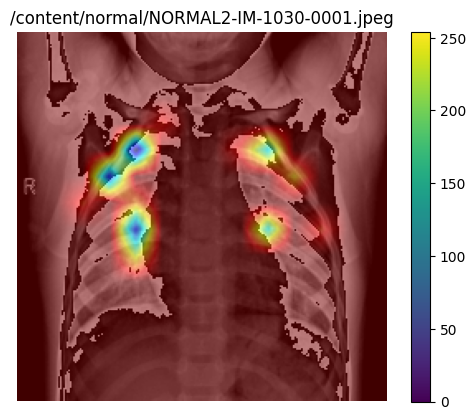
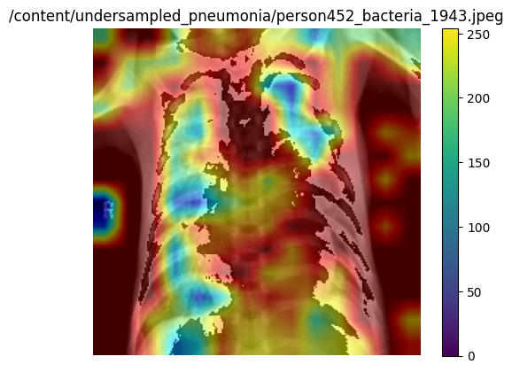
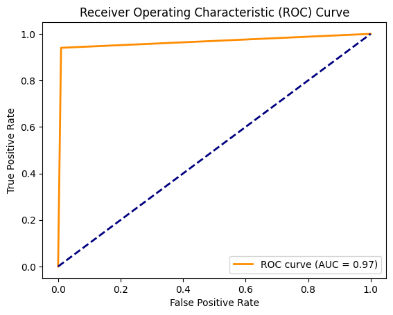

# Chest X-Ray Pneumonia Classification (Vision Transformer + Grad-CAM)

## Goal

The objective of this project is to classify pediatric chest X-rays into **Normal** or **Pneumonia** using a **Vision Transformer (ViT)** model, while also providing explainability through **Grad-CAM** heatmaps.

---

## Results

- ViT achieved **95–97% accuracy** on test data
- Strong precision/recall balance for both Normal and Pneumonia
- Grad-CAM visualizations confirm the model focuses on clinically relevant lung regions

**Outputs:**

| **Grad-CAM (Normal)** | **Grad-CAM (Pneumonia)** |
|------------------------|--------------------------|
|  |  |

- **ROC Curve** → 

---

## Dataset

- **Source:** [Chest X-Ray Images (Pneumonia) – Kaggle](https://www.kaggle.com/datasets/paultimothymooney/chest-xray-pneumonia)
- **Size:** 5,863 anterior-posterior X-ray images (JPEG)
- **Classes:** `Normal`, `Pneumonia`
- **Split:** Provided in `train/`, `val/`, and `test/` folders
- **Quality Control:** Images pre-screened and verified by multiple physicians

---

## Why Vision Transformer (ViT)?

I initially experimented with CNNs, but they consistently overfit and struggled with varying image qualities.  
ViT (`vit-base-patch16-224`) offered several advantages:

- **Global context modeling:** Self-attention captures long-range dependencies in images
- **Transfer learning:** Pretrained on ImageNet, adapted for binary classification
- **Robustness:** Better generalization compared to CNNs for this dataset

---

## Data Preprocessing and Loading

- Preprocessing pipeline:
  - Resize → 224×224
  - Convert to RGB
  - Normalize with mean = 0.5, std = 0.5 per channel
- Data balancing: Pneumonia class undersampled to match Normal class
- Split: **60% train, 20% validation, 20% test**
- Loaded via PyTorch `DataLoader` with batch size = 16

---

## Model and Training

- **Base Model:** `ViTForImageClassification` (`google/vit-base-patch16-224`)
- **Head:** Adapted from 1000 classes → 2 classes for Binary Classification (Normal, Pneumonia)
- **Loss:** CrossEntropyLoss
- **Optimizer:** AdamW (lr = 1e-4) with gradient clipping
- **Device:** CUDA if available
- **Training Epochs:** 5
- **Checkpoint:** Saved as `vit_model.pth`

---

## Model Evaluation

**Classification Report (Test Set – 634 images):**

| Class        | Precision | Recall | F1-Score | Support |
| ------------ | --------- | ------ | -------- | ------- |
| Normal       | 0.94      | 0.99   | 0.97     | 317     |
| Pneumonia    | 0.99      | 0.94   | 0.96     | 317     |
| **Accuracy** |           |        | **0.97** | 634     |
| Macro Avg    | 0.97      | 0.97   | 0.97     | 634     |
| Weighted Avg | 0.97      | 0.97   | 0.97     | 634     |

When reloaded in Grad-CAM notebook:

- **Accuracy:** ~97%
- **Balanced performance:** Precision and recall both ~0.94–0.99

ROC-AUC: Achieved **>0.95**, with well-separated ROC curves for both classes.  

---

## Explainability via Grad-CAM

- Grad-CAM hooks added to final ViT encoder layer
- Token activations reshaped into **14×14 patch grid** and upsampled to input size
- Overlaid heatmaps highlight lung regions most influential for predictions

---

## How to Run

### Environment Setup

```bash
pip install torch torchvision torchaudio
pip install transformers

import torch
from transformers import ViTForImageClassification

model = ViTForImageClassification.from_pretrained(
    'google/vit-base-patch16-224',
    num_labels=2,
    ignore_mismatched_sizes=True
)
# Load the model state dict
model.load_state_dict(torch.load('vit_model.pth', map_location=torch.device('cpu')))
device = torch.device("cuda" if torch.cuda.is_available() else "cpu")
model.to(device)

model.eval()  # Set the model to evaluation mode if you are using it for inference

```


